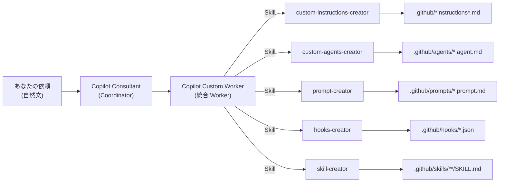

# GitHub Copilot Consultant

GitHub Copilotのカスタマイズを行うためのベースをそろえたRepoです。

**狙い:** カスタムエージェント「Copilot Consultant」を入口にして、統合 Worker エージェント「Copilot Custom Worker」へ作業を委譲し、`.github` 配下のカスタマイズ一式を生成・更新できるようにするサンプルです。

## ひと目でわかる関係図



## リポジトリ構成

```
.github/
├── copilot-instructions.md          # Always-on instructions（全体共通ルール）
├── agents/
│   ├── copilot-consultant.agent.md  # Coordinator（入口・オーケストレーター）
│   └── copilot-custom-worker.agent.md  # 統合 Worker（全カスタマイズ種別を担当）
├── prompts/
│   ├── update-copilot-customizations.prompt.md  # カスタマイズ資産の最新化
│   └── update-skill-creator.prompt.md           # skill-creator の改善・更新
├── skills/
│   ├── custom-instructions-creator/   # Instructions 作成ナレッジ
│   ├── custom-agents-creator/         # Custom Agents 作成ナレッジ
│   ├── prompt-creator/                # Prompt Files 作成ナレッジ
│   ├── hooks-creator/                 # Hooks 作成ナレッジ
│   └── skill-creator/                 # Skills 作成ナレッジ（scripts/ 同梱）
└── workflows/
    └── copilot-setup-steps.yml        # Copilot coding agent 用セットアップ
```

## 何がどこに出る？（対応表）

| あなたの目的 | Coordinator が委譲する Worker | Worker が使う Skill | 目に見える成果物（例） |
| --- | --- | --- | --- |
| 口調・規約・禁止事項を揃える | Copilot Custom Worker | `custom-instructions-creator` | `.github/*instructions*.md` |
| 専用の作業係（役割）を作る | Copilot Custom Worker | `custom-agents-creator` | `.github/agents/*.agent.md` |
| 定型タスクを `/` で呼べる化 | Copilot Custom Worker | `prompt-creator` | `.github/prompts/*.prompt.md` |
| 自動化（開始時/ツール前後） | Copilot Custom Worker | `hooks-creator` | `.github/hooks/*.json` |
| 新しいスキルを追加する | Copilot Custom Worker | `skill-creator` | `.github/skills/**/SKILL.md` |

## プロンプトファイル（/コマンド）

| コマンド | 説明 |
| --- | --- |
| `/update-copilot-customizations` | `.github/` 配下のカスタマイズ資産を公式ドキュメントの最新情報に合わせて点検・更新する |
| `/update-skill-creator` | `skill-creator` Skill を最新仕様・ベストプラクティスに沿って改善する |

## 使い方

### 基本フロー
1. このリポジトリをVS Codeで開く
2. Copilot Chatでカスタムエージェント「Copilot Consultant」を起動
3. やりたいことを自然言語で依頼
4. Coordinator が適切な Worker に作業を委譲し、成果物をドラフト
5. 生成・更新されたファイルをレビューして取り込む

### 依頼例
- 「このリポジトリの開発規約に沿うように、Copilotをいい感じにカスタマイズする案を出して」
- 「～で使うカスタムエージェントを作って。役割と禁止事項も含めて」
- 「～をするスキルを作成して」
- 「既存のカスタマイズが古いので、現状の構成に合わせて更新して」

### /コマンドの使い方
- Copilot Chatで `/update-copilot-customizations` と入力すると、カスタマイズ資産の棚卸し・最新化を開始

## 設計方針

- **Coordinator は編集しない**: Copilot Consultant はヒアリング・提案・合意取得に専念し、ファイル操作は Worker に委任（コンテキスト分離と並列実行のため）
- **合意ファースト**: どの Worker もユーザー合意なしにファイルを変更しない（差分案のみ返す）
- **最小差分**: 新規ファイル追加より既存ファイルの更新を優先
- **スコープ厳守**: 変更対象は `.github/` 配下の Copilot カスタマイズ成果物のみ（ワークフロー・テンプレ・アプリコードは対象外）

## 運用メモ
- 生成物は必ずレビューしてから取り込む（規約・安全・意図ズレ防止）
- VS Code Chat の Diagnostics で instructions / skills の読み込み状況を確認できる
