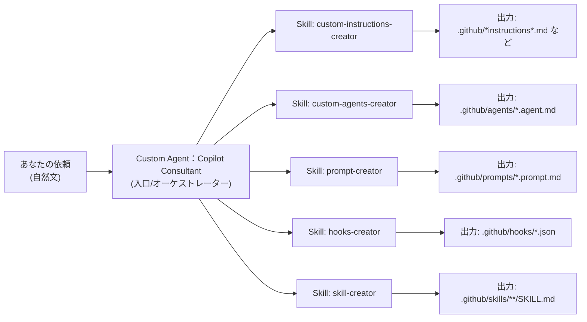

# GitHub Copilot Consultant
GitHub Copilotのカスタマイズを行うためのベースをそろえたRepoです。

**狙い:** カスタムエージェント「Copilot Consultant」を入口にして、必要なスキルを呼び分け、`.github` 配下のカスタマイズ一式を生成・更新できるようにするサンプルです。

## ひと目でわかる関係図

## 何がどこに出る？（対応表）

| あなたの目的 | エージェントが呼ぶもの | 目に見える成果物（例） |
| --- | --- | --- |
| 口調・規約・禁止事項を揃える | `custom-instructions-creator` | `.github/*instructions*.md` |
| 専用の作業係（役割）を作る | `custom-agents-creator` | `.github/agents/*.agent.md` |
| 定型タスクを `/` で呼べる化 | `prompt-creator` | `.github/prompts/*.prompt.md` |
| 自動化（開始時/ツール前後） | `hooks-creator` | `.github/hooks/*.json` |
| 新しいスキルを追加する | `skill-creator` | `.github/skills/**/SKILL.md` |

## 使い方

### 基本フロー
1. このリポジトリをVS Codeで開く
2. Copilot Chatでカスタムエージェント「Copilot Consultant」を起動
3. やりたいことを自然言語で依頼
4. 生成・更新されたファイルをレビューして取り込む

### 依頼例（プロンプトの書き方）
- 「このリポジトリの開発規約に沿うように、Copilotをいい感じにカスタマイズする案を出して」
- 「～で使うカスタムエージェントを作って。役割と禁止事項も含めて」
- 「～をするスキルを作成して」
- 「既存のカスタマイズが古いので、現状の構成に合わせて更新して」

## 運用メモ
- 生成物は必ずレビューしてから取り込む（規約・安全・意図ズレ防止）
