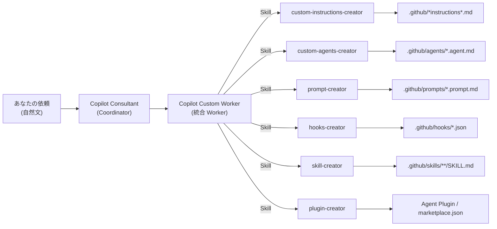

# GitHub Copilot Consultant

GitHub Copilot のカスタマイズ（instructions / prompts / agents / skills / hooks）を効率的に作成・管理するための **Agent Plugin** です。

**狙い:** カスタムエージェント「Copilot Consultant」を入口にして、統合 Worker エージェント「Copilot Custom Worker」へ作業を委譲し、`.github` 配下のカスタマイズ一式を生成・更新します。Plugin としてインストールすれば、どのリポジトリでもすぐに使えます。

## ひと目でわかる関係図



## リポジトリ構成

```
.github/
├── copilot-instructions.md          # Always-on instructions（全体共通ルール）
├── instructions/
│   └── spec-driven-workflow.instructions.md  # 仕様駆動ワークフロー
├── agents/
│   ├── copilot-consultant.agent.md  # Coordinator（入口・オーケストレーター）
│   └── copilot-custom-worker.agent.md  # 統合 Worker（全カスタマイズ種別を担当）
├── prompts/
│   ├── update-copilot-customizations.prompt.md  # カスタマイズ資産の最新化
│   └── update-skill-creator.prompt.md           # skill-creator の改善・更新
├── skills/
│   ├── custom-instructions-creator/   # Instructions 作成ナレッジ
│   ├── custom-agents-creator/         # Custom Agents 作成ナレッジ
│   ├── prompt-creator/                # Prompt Files 作成ナレッジ
│   ├── hooks-creator/                 # Hooks 作成ナレッジ
│   ├── skill-creator/                 # Skills 作成ナレッジ（scripts/ 同梱）
│   └── plugin-creator/                # Agent Plugins 作成ナレッジ
└── workflows/
    └── copilot-setup-steps.yml        # Copilot coding agent 用セットアップ
plugins/
├── copilot-consultant/                # Copilot カスタマイズ管理 Plugin
└── spec-driven-workflow/              # 仕様駆動ワークフロー Plugin
```

## 何がどこに出る？（対応表）

| あなたの目的 | Coordinator が委譲する Worker | Worker が使う Skill | 目に見える成果物（例） |
| --- | --- | --- | --- |
| 口調・規約・禁止事項を揃える | Copilot Custom Worker | `custom-instructions-creator` | `.github/*instructions*.md` |
| 専用の作業係（役割）を作る | Copilot Custom Worker | `custom-agents-creator` | `.github/agents/*.agent.md` |
| 定型タスクを `/` で呼べる化 | Copilot Custom Worker | `prompt-creator` | `.github/prompts/*.prompt.md` |
| 自動化（開始時/ツール前後） | Copilot Custom Worker | `hooks-creator` | `.github/hooks/*.json` |
| 新しいスキルを追加する | Copilot Custom Worker | `skill-creator` | `.github/skills/**/SKILL.md` |
| カスタマイズをPluginに変換 | Copilot Custom Worker | `plugin-creator` | `plugins/<name>/plugin.json` |

## 使い方

> ⚠️ Agent Plugins は Preview 機能です。VS Code の設定で `chat.plugins.enabled` を `true` にしてください。

### 1. Plugin をインストール

以下のいずれかの方法でインストールします。

#### 方法 A: マーケットプレイスから（推奨）

VS Code の `settings.json` に以下を追加：

```jsonc
"chat.plugins.marketplaces": ["yuma-722/github-copilot-consultant"]
```

Extensions ビューで `@agentPlugins` を検索 → **copilot-consultant** → **Install**

#### 方法 B: ソースから直接インストール

1. コマンドパレット（`Ctrl+Shift+P`）を開く
2. `Chat: Install Plugin From Source` を実行
3. `https://github.com/yuma-722/github-copilot-consultant` を入力

#### 方法 C: ローカルインストール

リポジトリをクローンし、`settings.json` に追加：

```jsonc
"chat.pluginLocations": {
  "/path/to/github-copilot-consultant/plugins/copilot-consultant": true
}
```

### 2. Copilot Chat で利用する

インストール後、任意のワークスペースの Copilot Chat から利用できます。

1. Copilot Chat を開く
2. カスタムエージェント`copilot-consultant` に切り替える
3. やりたいことを自然言語で依頼する
4. 生成・更新されたファイルをレビューして取り込む

### 3. /コマンドを使う

Plugin インストール後は以下のスラッシュコマンドも利用できます：

| コマンド | 説明 |
| --- | --- |
| `/copilot-consultant:update-copilot-customizations` | カスタマイズ資産を公式ドキュメントの最新情報に合わせて点検・更新する |
| `/copilot-consultant:update-skill-creator` | skill-creator Skill を最新仕様に沿って改善する |

### 依頼例

- 「このリポジトリの開発規約に沿うように、Copilot をいい感じにカスタマイズする案を出して」
- 「～で使うカスタムエージェントを作って。役割と禁止事項も含めて」
- 「～をするスキルを作成して」
- 「既存のカスタマイズが古いので、現状の構成に合わせて更新して」

### チームに Plugin を推奨する

チームメンバーに自動で Plugin を推奨するには、ワークスペース設定に追加：

```jsonc
{
  "extraKnownMarketplaces": {
    "github-copilot-consultant": {
      "source": {
        "source": "github",
        "repo": "yuma-722/github-copilot-consultant"
      }
    }
  },
  "enabledPlugins": {
    "copilot-consultant@github-copilot-consultant": true
  }
}
```

### 前提条件

- VS Code（Insiders 推奨）
- GitHub Copilot（Chat 有効）
- `chat.plugins.enabled`: `true`
- Docker（awesome-copilot MCP サーバー利用時）

## 設計方針

- **Coordinator は編集しない**: Copilot Consultant はヒアリング・提案・合意取得に専念し、ファイル操作は Worker に委任（コンテキスト分離と並列実行のため）
- **合意ファースト**: どの Worker もユーザー合意なしにファイルを変更しない（差分案のみ返す）
- **最小差分**: 新規ファイル追加より既存ファイルの更新を優先
- **スコープ厳守**: 変更対象は `.github/` 配下の Copilot カスタマイズ成果物のみ（ワークフロー・テンプレ・アプリコードは対象外）

## 運用メモ
- 生成物は必ずレビューしてから取り込む（規約・安全・意図ズレ防止）
- VS Code Chat の Diagnostics で instructions / skills の読み込み状況を確認できる

---

# このRepoを活用した仕様駆動の開発フロー（Plan → カスタマイズ → 実装）

このリポジトリを使った推奨開発フローは以下の通りです：

### 1. Plan mode で仕様を固める
- Copilot の **Plan mode** を使って、作りたいものの仕様・要件を対話的に整理
- アイデアを具体化し、実装に必要な要素を洗い出す

### 2. 「Open in Editor」でプロンプトファイル化
- Plan mode で固めた仕様を **「Open in Editor」** 機能でエディタに展開
- `.github/prompts/` 配下に `.prompt.md` として保存（例: `build-xxx-feature.prompt.md`）
- 保存したプロンプトファイルは再利用可能な定型タスクとして `/` コマンド化される

### 3. Copilot Consultant で Copilot のカスタマイズ
- 保存したプロンプトファイルを **Copilot Consultant** に読み込ませる
- プロジェクトの実装に必要な Copilot カスタマイズ（エージェント、指示、スキルなど）を提案・生成
- カスタマイズ内容をレビューして `.github/` 配下に取り込む

### 4. Agent Mode でドキュメント生成→実装開始
- カスタマイズが完了したら、保存したプロンプトファイルを **Agent Mode** で実行
- 必要なドキュメント（要件定義、設計書など）を自動生成
- カスタマイズされた Copilot の支援を受けながら実装を進める

### 利点
- **再現性**: 仕様がプロンプトファイルとして残るため、何度でも同じタスクを呼び出せる
- **カスタマイズの最適化**: プロジェクト固有のルールや制約を Copilot に事前学習させられる
- **効率化**: 仕様→カスタマイズ→実装の一連の流れが標準化され、迷わず開発を進められる

